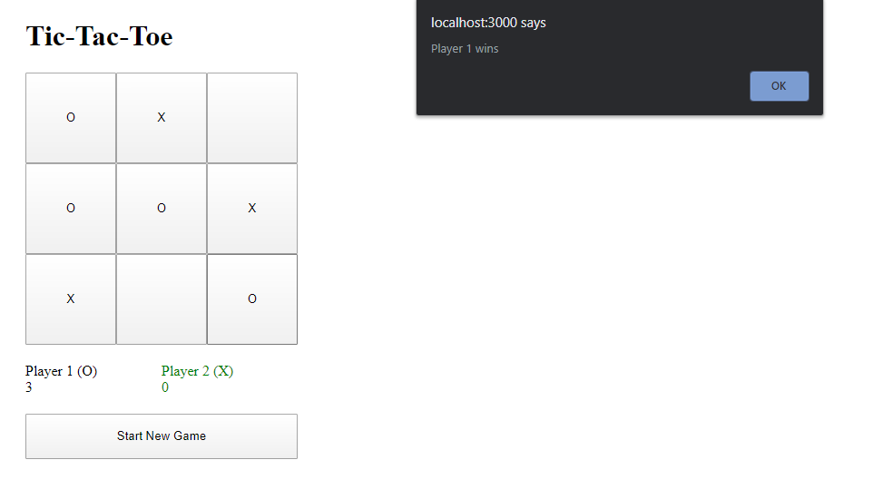

This project was bootstrapped with [Create React App](https://github.com/facebook/create-react-app).

## Setup Instructions

1) Download the project.
2) Make sure you have installed <b>Node.js</b> and <b>npm</b> is working on your terminal
3) In the project directory, run:
    ### `npm install`
    This will install all the dependencies.
4) In the project directory, run:
    ### `npm start`
    Runs the app in the development mode. 
    Open [http://localhost:3000](http://localhost:3000) to view it in the browser.

The page will reload if you make edits. 
You will also see any lint errors in the console.

## Screenshot

 </img>
